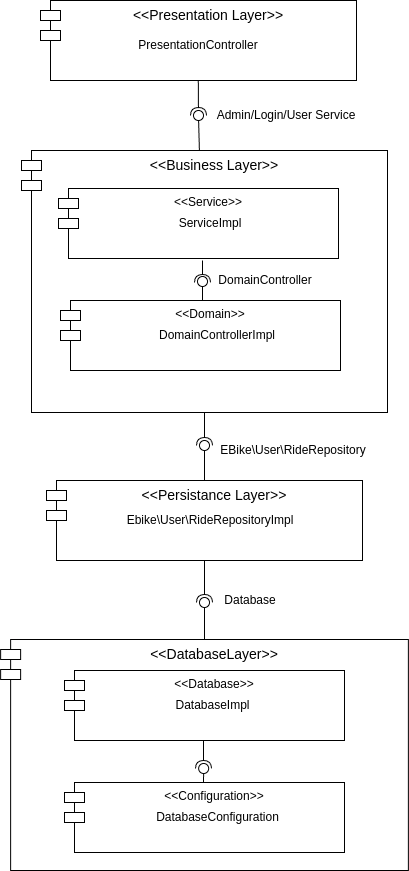
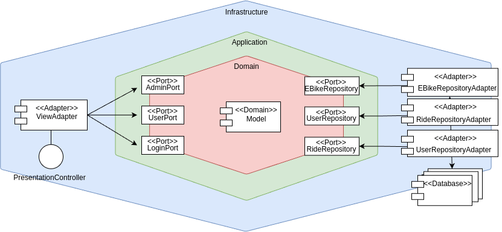
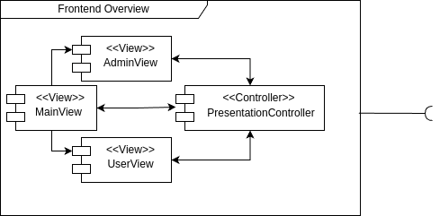

=== Architettura Layered

Grafico che rappresenta l'architettura a layer del progetto, si può notare come il progetto sia diviso in quattro layer principali:

- Presentation : Contiene le classi che si occupano di presentare i dati all'utente, in particolare le classi che si occupano di gestire la parte grafica dell'applicazione.
- Business : Contiene le classi che si occupano di gestire la logica di business dell'applicazione, in particolare le classi che si occupano di gestire le operazioni sui dati. Si puo notare una divisione netta tra Service e Domain, in questo specifico contesto si è deciso di dividere i due layer per rendere più chiara la separazione tra la logica di business e la logica di dominio, permettendo di avere una maggiore manutenibilità del codice. In questo modo possono essere aggiunti servizi senza dover modificare la logica di dominio.
- Persistence : Contiene le classi che si occupano di gestire la persistenza dei dati, in particolare le classi che si occupano di gestire le operazioni di lettura e scrittura dei dati.
- Database: Contiene le classi che si occupano di gestire la connessione con il database, per ottenere la tecnologia da utilizzare viene utilizzato un file di configurazione. La classe DatabaseConfiguration consente di recuperare il contenuto del file.
Per il passaggio di dati tra un layer e l'altro sono stati usati specifici DTO (Data Transfer Object) che permettono di incapsulare i dati necessari staccando la parte logica, ogni layer ha quindi implementato un Mapper per rimappare i dati ricevuti al modello di layer.

=== Architettura Hexagonal

Grafico che rappresenta l'architettura esagonale del progetto, si può notare come il progetto sia diviso in tre parti principali:

- Domain : Contiene le classi che si occupano di gestire la logica di dominio dell'applicazione.
- Application : Contiene le classi che si occupano di gestire la logica di business dell'applicazione, in particolare le classi che si occupano di gestire le operazioni sui dati e l'interazione con il dominio.
- Infrastructure : Contiene le classi che si occupano di gestire le architetture esterne ad esempio la persistenza dei dati, in particolare le classi che si occupano di gestire le operazioni di lettura e scrittura dei dati su database e le classi per il frontend.
Sono state definite le porte per la comunicazione tra le varie parti dell'applicazione, in particolare sono state definite le porte per la comunicazione tra il frontend e l' application (AdminViewPort, UserViewPort e LoginViewPort), tra l' application e il database (EBikeRepositoryAdapter, RideRepositoryAdapter e UserRepositoryAdapter) e tra l' application e il dominio (non presente nel grafico EBikeApplication).
Per il passaggio di dati tra application e adapter sono stati usati specifici DTO (Data Transfer Object) che permettono di incapsulare i dati necessari staccando la parte logica.

=== Frontend

Grafico che rappresenta l'architettura del frontend del progetto, si possono notare 3 view principali che interagiscono con il PresentationController, ovvero il controller che viene utilizzato per l' allacciamento dell frontend con le due differenti architetture.